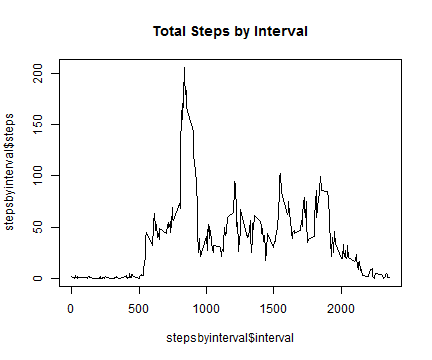
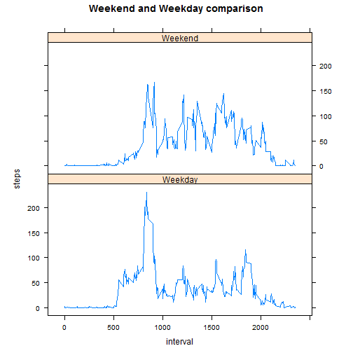

Load the CSV data file. (Assumption: Current Directory contains the file)


```r
data <- read.csv("Activity.csv")
data1 <- transform(data, date <- factor(date))
```

### What is mean total number of steps taken per day?
Histogram of the total number of steps taken each day


```r
steps <- aggregate(steps ~ date, data1, sum, na.rm = TRUE)
hist(steps$steps,plot=TRUE, main="Histogram of Total Steps with NA ignored")
```

 

```r
##barplot(steps, main="# steps by day", xlab="Date", ylab="Total Steps")
```

Calculate and report the mean and median total number of steps taken per day


```r
mean(steps$steps)
```

```
## [1] 10766
```

```r
median(steps$steps)
```

```
## [1] 10765
```
###What is the average daily activity pattern?

1.Make a time series plot (i.e. type = "l") of the 5-minute interval (x-axis) and the average number of steps taken, averaged across all days (y-axis)


```r
stepsbyinterval <- aggregate(steps ~ interval, data1, mean)
plot(stepsbyinterval$interval, stepsbyinterval$steps,type="l", main="Total Steps by Interval")
```

 

2. Which 5-minute interval, on average across all the days in the dataset,contains the maximum number of steps?


```r
stepsbyinterval[which.max(stepsbyinterval$steps),]$interval
```

```
## [1] 835
```

###Imputing missing values

1. Calculate and report the total number of missing values in the dataset (i.e. the total number of rows with NAs)

```r
## Number of rows with NA values
sum(!complete.cases(data1))
```

```
## [1] 2304
```

2. Devise a strategy for filling in all of the missing values in the dataset. The strategy does not need to be sophisticated. 

For strategy We will use the mean for the interval which was calculated in the above steps

3. Create a new dataset that is equal to the original dataset but with the missing data filled in

```r
data2 <- data1

for (i in 1:nrow(data2))
    if (is.na(data2$steps[i]))
      {
        steps_mean <- stepsbyinterval$steps[which(stepsbyinterval$interval == data2$interval[i])]
        data2$steps[i] <- steps_mean
      }
```

4.Make a histogram of the total number of steps taken each day and Calculate and report the mean and median total number of steps taken per day


```r
stepsfilled <- aggregate(steps ~ date, data2, sum)
hist(stepsfilled$steps,plot=TRUE, main="Histogram of Total Steps by day NA replaced")
```

 

```r
mean(stepsfilled$steps)
```

```
## [1] 10766
```

```r
median(stepsfilled$steps)
```

```
## [1] 10766
```

```r
## Compare the mean and median between filled and original data 
mean(stepsfilled$steps) - mean(steps$steps)
```

```
## [1] 0
```

```r
median(stepsfilled$steps) - median(steps$steps)
```

```
## [1] 1.189
```

The mean is same but there is a little change in median value.

### Are there differences in activity patterns between weekdays and weekends?
1. Create a new factor variable in the dataset with two levels - "weekday" and "weekend" indicating whether a given date is a weekday or weekend day.


```r
data2$DOW <- weekdays(as.Date(data2$date))
data2$day <- ifelse(data2$DOW %in% c("Saturday", "Sunday"), "Weekend","Weekday")
data2 <- transform(data2, day=factor(day))
```

2. Make a panel plot containing a time series plot (i.e. type = "l") of the 5-minute interval (x-axis) and the average number of steps taken, averaged across all weekday days or weekend days (y-axis). 


```r
stepsbyintervalDay <- aggregate(steps ~ interval + day, data2, mean)
library(lattice)
xyplot(steps ~ interval | day, data = stepsbyintervalDay, type = "l", aspect=1/2, main="Weekend and Weekday comparison")
```

 

This is the end.
